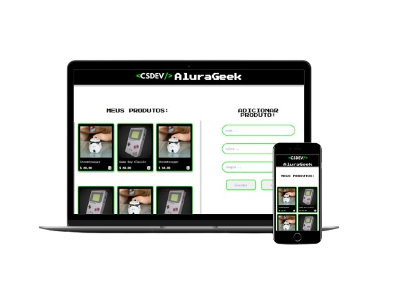

<h1 align="center">
    
    
AluraGeek

</h1>

## Descrição do projeto:
Este projeto tem como objetivo simular uma API RESTful utilizando o JSON Server para praticar requisições HTTP (GET, POST e DELETE). Além disso, foram exploradas as seguintes tecnologias e conceitos:

Manipulação do DOM: Inserção de imagens e atualização da interface com base nas informações da API.
JavaScript: Captura de eventos, funções, métodos como splice e remove para manipular dados.
Este projeto foi uma ótima oportunidade para aprimorar minhas habilidades em programação e desenvolvimento web.

## Tecnologias utilizadas:

 
  
   
    

 
